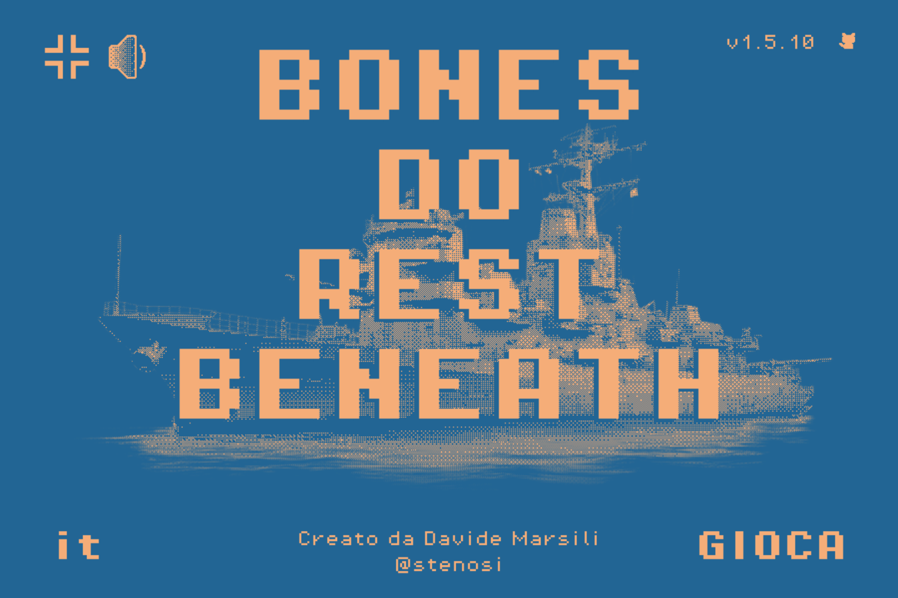
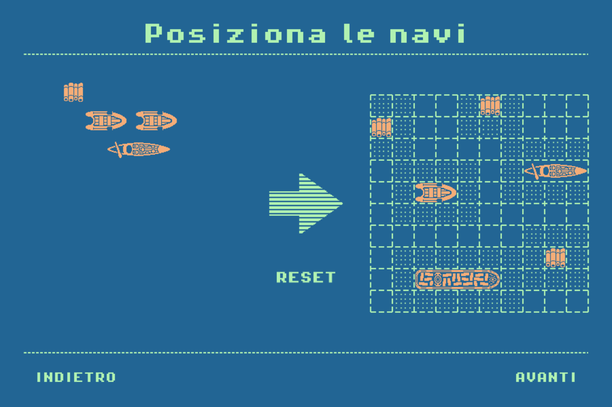
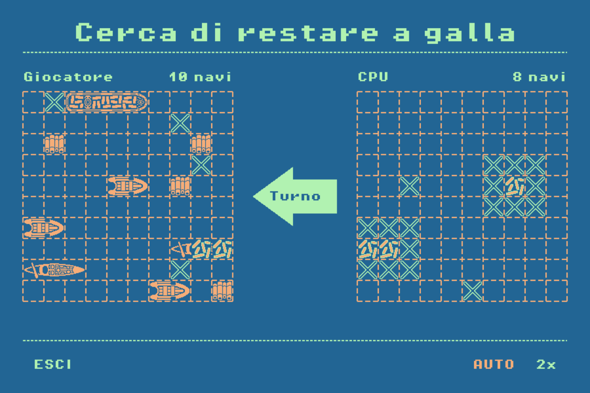

# Bones Do Rest Beneath

[](README.md)
[](README.it.md)
[](https://5stenosi.github.io/Bones-Do-Rest-Beneath/)

---

> *Un gioco di Battaglia navale con un'anima marittima.*
> Ispirato a [**The Sea Has No Claim**](https://dukope.com/sea/play.html) di Lucas Pope.

<!-- Screenshot consigliato: schermata del menu principale (vedi sezione "Screenshot" in fondo) -->

---

## Il gioco

**Bones Do Rest Beneath** è un gioco di **Battaglia navale** in singolo giocatore, realizzato con [Phaser 3](https://phaser.io/). Ti scontri contro un avversario controllato dal computer su un mare a griglia: posiziona la tua flotta, poi affonda la sua prima che affondi la tua.

Il gioco si ispira visivamente e tematicamente a [**The Sea Has No Claim**](https://dukope.com/sea/play.html) — un videogioco web di Lucas Pope — fondendo un'estetica pixel retrò con un'atmosfera nautica silenziosa e malinconica.

Sviluppato in **23 giorni** (12 settembre – 5 ottobre 2025) attraverso 13 versioni rilasciate. **[Giocalo qui.](https://5stenosi.github.io/Bones-Do-Rest-Beneath/)**

---

## Funzionalità

- **Posizionamento a trascinamento** con validazione automatica della adiacenza
- **Avversario CPU** con intelligenza artificiale a caccia (passa alla modalità mira dopo un colpo a segno)
- **Modalità automatica** — lascia che la simulazione giochi da sola a velocità 1× o 2×
- **Schermo intero** e **controllo volume a 3 livelli**
- **Bilingue** — italiano e inglese
- **Scena changelog** accessibile dal menu principale

---

## Stile ed estetica

Il gioco utilizza una palette di tre colori tratta dal mondo marittimo, abbinata a un font pixel per un tocco retrò.

-  **Matisse** `#226594` — Blu oceano profondo, sfondi e cornice dell'UI
-  **Madang** `#b1f2b1` — Verde schiuma pallido, testi ed etichette
-  **Tacao** `#f5ad78` — Ambra calda, navi, accenti ed elementi in rilievo

**Tipografia:** [PixelOperator8](https://notoverdose.itch.io/pixel-operator) — un font pixel 8-bit pulito usato in tutto il gioco.

**Canvas:** 900 × 600 px, adattato e centrato su qualsiasi schermo.

---

## La flotta

| Nave        | Dimensione | Quantità |
| ----------- | ---------- | -------- |
| Zattera     | 1 × 1      | ×4       |
| Gommone     | 1 × 2      | ×3       |
| Gondola     | 1 × 3      | ×2       |
| Cargo       | 1 × 4      | ×1       |

Le navi non possono essere posizionate adiacenti l'una all'altra (incluse le diagonali). La stessa regola si applica alla flotta della CPU.

---

## Gameplay

1. **Fase di posizionamento** — trascina le 10 navi sulla tua griglia. Clicca su una nave per ruotarla.
2. **Fase di battaglia** — clicca su una cella della griglia nemica per sparare. Il rosso indica un colpo, il bianco un mancato.
3. **Condizione di vittoria** — affonda tutte e 10 le navi nemiche prima che le tue vengano affondate.

### Modalità di gioco

| Modalità  | Descrizione                                                         |
| --------- | -------------------------------------------------------------------- |
| Manuale   | Clicchi tu stesso ogni colpo                                        |
| Auto      | Entrambi i lati sparano automaticamente con un breve ritardo        |
| 2×        | Modalità Auto a velocità doppia (richiede che Auto sia attivo prima) |

---

## Installazione

Nessun passaggio di build richiesto. Il progetto gira interamente nel browser via CDN.

### Opzione A — Apri direttamente

```text
Doppio clic su index.html
```

Alcuni browser bloccano i moduli ES caricati da `file://`. Se il gioco non si avvia, usa l'Opzione B.

### Opzione B — Server locale

Qualsiasi server statico funziona. Esempi:

```bash
# Python
python -m http.server 8080

# Node.js (npx)
npx serve .

# VS Code
# Installa l'estensione "Live Server" e clicca su "Go Live"
```

Poi apri `http://localhost:8080` nel browser.

---

## Variabili d'ambiente

Questo progetto **non ha variabili d'ambiente**. Non usa nessun build tool e carica Phaser 3 direttamente da CDN. Non è necessario alcun file `.env` o configurazione aggiuntiva.

---

## Struttura del progetto

```text
PhaserTest-1/
├── index.html              # Punto di ingresso
├── src/
│   ├── game.js             # Configurazione Phaser e registro scene
│   ├── colors.js           # Palette colori condivisa
│   ├── changelog.js        # Dati della cronologia versioni
│   ├── scenes/             # Scene di gioco (Boot, Menu, Selezione, Gioco, Changelog)
│   ├── game-objects/       # Oggetti Phaser riutilizzabili (Nave, Popup, Bottoni…)
│   ├── managers/           # Moduli logici (Battaglia, CPU, Navi, Trascinamento, Popup)
│   ├── config/             # Configurazione navi
│   └── i18n/               # Traduzioni (EN / IT)
├── assets/
│   ├── img/                # Sprite e sfondi
│   ├── audio/              # Musica ed effetti sonori
│   ├── fonts/              # File font PixelOperator8
│   └── cursors/            # Cursore personalizzato
└── styles/
    └── style.css
```

---

## Screenshot

**Menu principale** — titolo, sfondo e pulsanti del menu.



**Posizionamento navi** — pannello della flotta con le navi in fase di piazzamento sulla griglia.



**Battaglia in corso** — entrambe le griglie visibili con colpi e mancati.



---

## Crediti

- **Sviluppatore:** Davide Marsili
- **Engine:** [Phaser 3](https://phaser.io/)
- **Ispirazione:** [The Sea Has No Claim](https://dukope.com/sea/play.html) di Lucas Pope
- **Font:** [PixelOperator8](https://notoverdose.itch.io/pixel-operator)
- **Musica:** *After Dark* — cover 8-bit di Overkill
