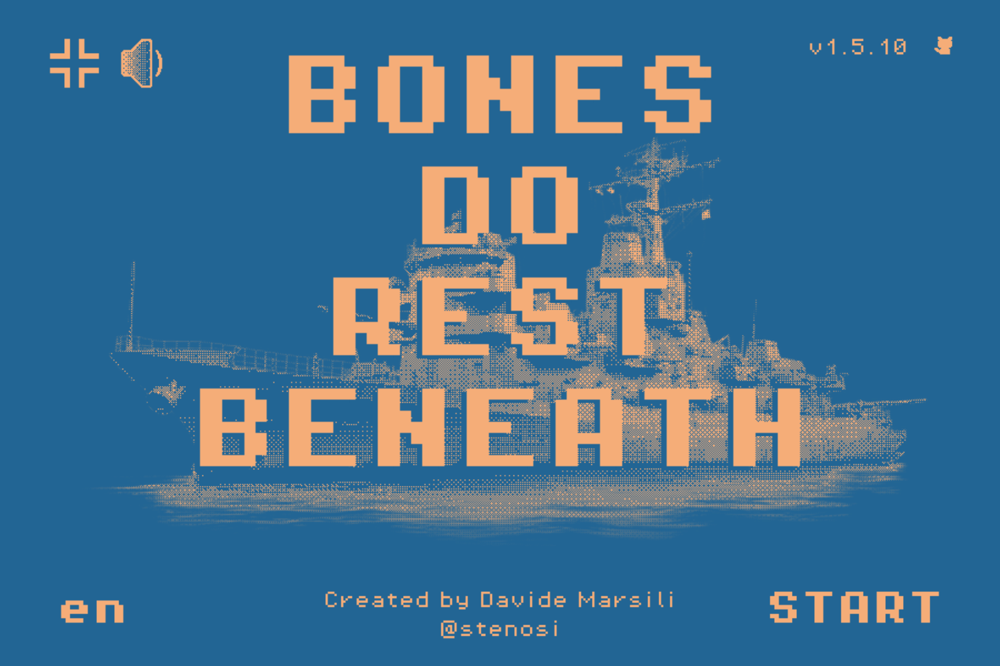
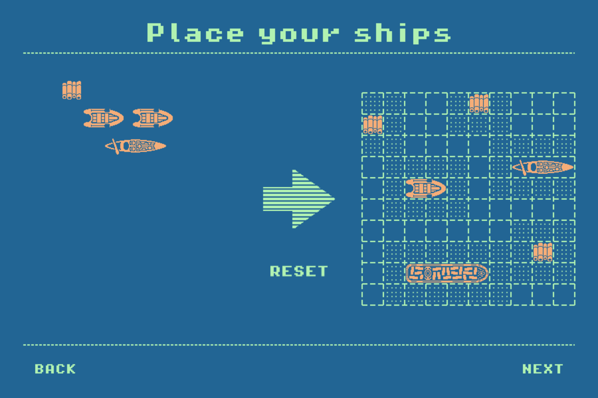
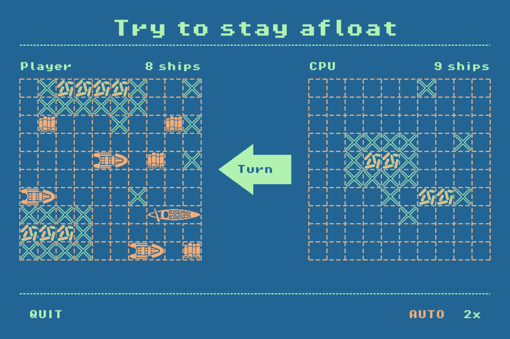

# Bones Do Rest Beneath

[](README.md)
[](README.it.md)
[](https://5stenosi.github.io/Bones-Do-Rest-Beneath/)

---

> *A Battleship game with a maritime soul.*
> Inspired by [**The Sea Has No Claim**](https://dukope.com/sea/play.html) by Lucas Pope.

<!-- Suggested screenshot: Main Menu screen (see "Screenshots" section at the bottom) -->

---

## About

**Bones Do Rest Beneath** is a single-player **Battleship** game built with [Phaser 3](https://phaser.io/). You face a CPU opponent on a grid-based sea: place your fleet, then sink theirs before they sink yours.

The game takes its visual and thematic inspiration from [**The Sea Has No Claim**](https://dukope.com/sea/play.html) — a web game by Lucas Pope — blending a retro pixel aesthetic with a quiet, melancholic nautical atmosphere.

Developed in **23 days** (12 September – 5 October 2025) across 13 released versions. **[Play it here.](https://5stenosi.github.io/Bones-Do-Rest-Beneath/)**

---

## Features

- **Drag-and-drop fleet placement** with automatic adjacency validation
- **CPU opponent** with hunting AI (switches to targeted mode after a hit)
- **Auto mode** — let the simulation play itself at 1× or 2× speed
- **Fullscreen support** and **3-level volume control**
- **Bilingual** — English and Italian
- **Changelog scene** accessible from the main menu

---

## Style & Aesthetics

The game uses a handpicked three-color palette drawn from the maritime world, paired with a pixel font for a retro feel.

-  **Matisse** `#226594` — Deep ocean blue, backgrounds and UI chrome
-  **Madang** `#b1f2b1` — Pale seafoam green, text and labels
-  **Tacao** `#f5ad78` — Warm amber, ships, accents and highlights

**Typography:** [PixelOperator8](https://notoverdose.itch.io/pixel-operator) — a clean 8-bit pixel font used throughout the game.

**Canvas:** 900 × 600 px, center-fitted to any screen.

---

## Fleet

| Ship       | Size  | Count |
| ---------- | ----- | ----- |
| Raft       | 1 × 1 | ×4    |
| Inflatable | 1 × 2 | ×3    |
| Gondola    | 1 × 3 | ×2    |
| Cargo      | 1 × 4 | ×1    |

Ships cannot be placed adjacent to one another (diagonal included). The same rule applies to the CPU's fleet.

---

## Gameplay

1. **Placement phase** — drag and drop your 10 ships onto your grid. Click a ship to rotate it.
2. **Battle phase** — click any cell on the enemy grid to fire. Red marks a hit, white marks a miss.
3. **Win condition** — sink all 10 enemy ships before yours are gone.

### Game Modes

| Mode   | Description                                                 |
| ------ | ----------------------------------------------------------- |
| Manual | You click each shot yourself                                |
| Auto   | Both sides fire automatically with a short delay            |
| 2×     | Auto mode at double speed (requires Auto to be enabled first) |

---

## Installation

No build step required. The project runs entirely in the browser via CDN.

### Option A — Open directly

```text
Double-click index.html
```

Some browsers restrict ES modules loaded from `file://`. If the game doesn't load, use Option B.

### Option B — Local static server

Any static server will work. Examples:

```bash
# Python
python -m http.server 8080

# Node.js (npx)
npx serve .

# VS Code
# Install the "Live Server" extension and click "Go Live"
```

Then open `http://localhost:8080` in your browser.

---

## Environment Variables

This project has **no environment variables**. It uses no build tool and loads Phaser 3 directly from CDN. No `.env` file or configuration is needed.

---

## Project Structure

```text
PhaserTest-1/
├── index.html              # Entry point
├── src/
│   ├── game.js             # Phaser config and scene registry
│   ├── colors.js           # Shared color palette
│   ├── changelog.js        # Version history data
│   ├── scenes/             # Game scenes (Boot, Menu, Selection, Game, Changelog)
│   ├── game-objects/       # Reusable Phaser game objects (Ship, Popup, Buttons…)
│   ├── managers/           # Logic modules (Battle, CPU, Ships, Drag, Popup)
│   ├── config/             # Ship configuration
│   └── i18n/               # Translations (EN / IT)
├── assets/
│   ├── img/                # Sprites and backgrounds
│   ├── audio/              # Music and sound effects
│   ├── fonts/              # PixelOperator8 font files
│   └── cursors/            # Custom cursor
└── styles/
    └── style.css
```

---

## Screenshots

**Main Menu** — title, background and menu buttons.



**Ship Placement** — fleet panel with ships being positioned on the grid.



**Mid-battle** — both grids visible with a mix of hits and misses.



---

## Credits

- **Developer:** Davide Marsili
- **Engine:** [Phaser 3](https://phaser.io/)
- **Inspiration:** [The Sea Has No Claim](https://dukope.com/sea/play.html) by Lucas Pope
- **Font:** [PixelOperator8](https://notoverdose.itch.io/pixel-operator)
- **Music:** *After Dark* — 8-bit cover by Overkill
